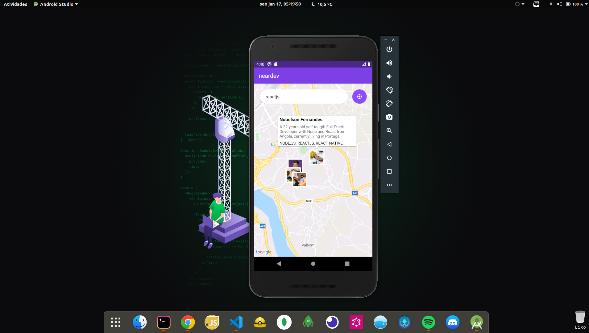

# Neardev (Mobile w/ React Native)



This is the frontend mobile version of Neardev and also the most important part of the project, it will give you access to the map that picks up your current location and you can type in a technology name and all developers using the technology typed within 10 kilometers will be returned.

## Getting Started

These instructions will get you a copy of the project up and running on your local machine (Real mobile device or simulator) for development and testing purposes. Feel free to deploy if you want.

### Prerequisites

You will need the [backend](https://github.com/nubelsondev/neardev-backend) to be running so that you can connect both sides of the Application putting the `BACKEND_URL` in the `.env` file.

```javascript
BACKEND_URL = urlBackend
```

### Installation

Clone the repository and run

```javascript
// With NPM
$ npm install
$ npm run start

// With Yarn
$ yarn install
$ yarn start
```

## Built With

-   [React Native](https://facebook.github.io/react-native/)
-   [React-Navigation](https://reactnavigation.org/)
-   [React-native-maps](https://github.com/react-native-community/react-native-maps)
-   [React-native-webview](https://github.com/react-native-community/react-native-webview)
-   [Axios](https://github.com/axios/axios)
-   [Expo](https://expo.io/)

## Contributing

Please feel free to send pull request if you want to contribute!

## Authors

-Nubelson - _Development_ - [nubelsondev](https://github.com/nubelsondev)
